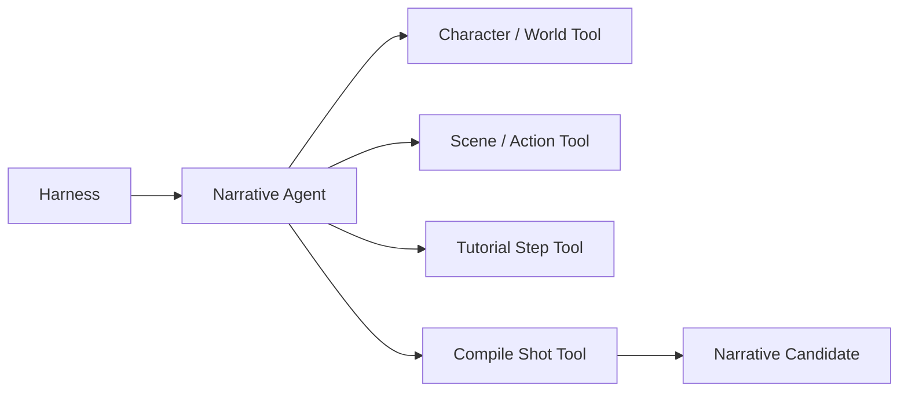
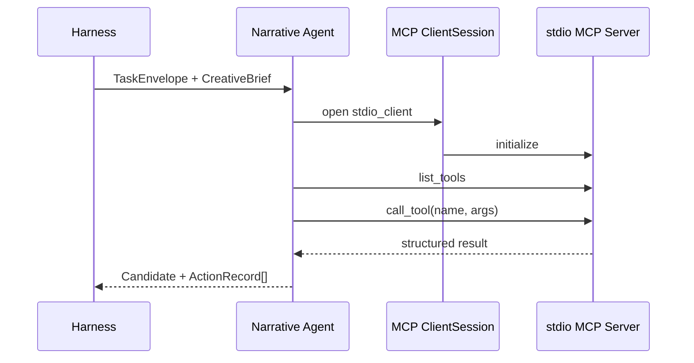
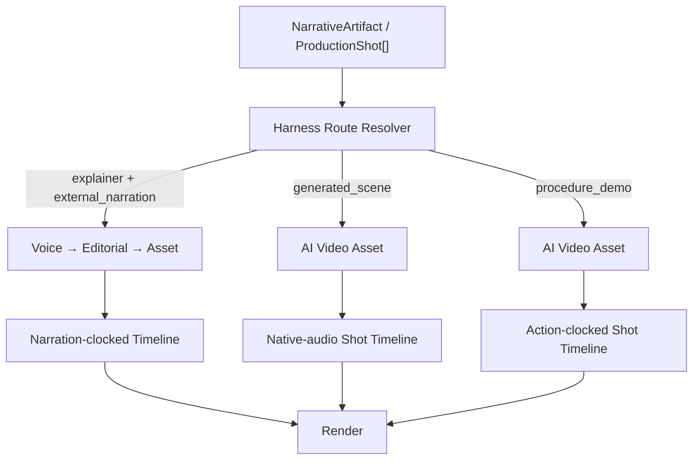

# Narrative Agent MCP 与多类型视频路径分流——PPT 制作摘要

## 1. PPT 定位

### 汇报主题

**从固定流水线到 Agent 自主编排：Narrative MCP 改造与多类型视频路径分流**

### 汇报目标

用一套简洁的技术汇报说明本次改造解决了什么问题、采用了什么边界设计，以及剧情、教程、科普三类视频如何进入不同生产路径。

听众在汇报结束后应理解以下三点：

1. Narrative 已从“代码写死步骤”改为“Agent 自主选择 MCP Tool”。
2. Agent 负责领域内规划，Harness 负责权限、路由、验收和状态提交。
3. 三类视频共享 `ProductionShot` 边界，但根据 Shot 的视听协议进入不同下游路径。

### 建议规格

- 页数：12 页正文，可增加 2 页附录。
- 汇报时长：12～18 分钟。
- 画布比例：16:9。
- 叙事方式：问题 → 架构 → MCP 执行 → Shot 协议 → 路由 → 实跑结果。

---

## 2. 整体视觉要求

### 风格关键词

简洁、克制、留白、浅色背景、工程感、清晰层级。

### 背景与颜色

- 主背景：暖白 `#F7F8FA` 或纯白 `#FFFFFF`。
- 主文字：深蓝黑 `#182033`。
- 次级文字：灰蓝 `#667085`。
- 主强调色：蓝色 `#356AE6`，用于 MCP、主路径和关键结论。
- Harness：深灰蓝 `#344054`。
- Agent：蓝色描边或浅蓝底 `#EAF0FF`。
- Tool：浅青色 `#E8F7F4`。
- 成功状态：绿色 `#2E9B72`。
- 分支路径可使用低饱和色：科普蓝、剧情紫、教程橙。

### 排版原则

- 每页只表达一个核心结论。
- 每页正文不超过 6 个信息点。
- 优先使用一张主图配少量说明，不堆叠卡片。
- 标题 30～36 pt，正文 18～22 pt，图中标签不低于 16 pt。
- 中文字体使用思源黑体、阿里巴巴普惠体或微软雅黑；英文与代码使用 Inter、Aptos 或 JetBrains Mono。
- 不使用渐变、玻璃拟态、3D 图标、大面积阴影和复杂纹理。
- 流程箭头采用 1.5～2 pt 细线；非核心连线使用浅灰。

### 图形语言

- Harness：外层边框或顶部控制条。
- Agent：一个稳定的圆角矩形。
- MCP Server：独立进程形状，可使用双边框矩形。
- MCP Tool：小型胶囊标签。
- Artifact：文档形状。
- Shot：编号为 `S01 / S02 / S03` 的窄卡片。
- 不要用机器人插画表示 Agent，以免削弱工程架构感。

---

## 3. 逐页内容设计

## 第 1 页｜封面

### 标题

**从固定流水线到 Agent 自主编排**

### 副标题

Narrative Agent MCP 改造与多类型视频路径分流

### 页面内容

- 项目名：UGC Video Generation Harness
- 本次范围：Narrative / MCP / ProductionShot / Harness Routing
- 日期与汇报人信息放在左下角。

### 视觉建议

页面中央只放一条简化流程：

```text
CreativeBrief → Narrative Agent ⇄ MCP Tools → ProductionShot → Harness Routes
```

用蓝色强调 `Narrative Agent ⇄ MCP Tools`，其余保持灰色。

---

## 第 2 页｜原有问题：一条口播链路无法覆盖所有视频

### 核心结论

**原流程天然适合科普口播，但不能自然表达剧情演绎和制作教程。**

### 页面内容

原科普链路：

```text
Section → Beat → Script → TTS → Editorial → Asset → Timeline → Render
```

三类视频的主驱动力不同：

| 类型 | 内容驱动力 | 画面驱动力 | 音频来源 |
|---|---|---|---|
| 科普 | 观点与信息 Beat | 口播对应视觉 | 独立 TTS |
| 剧情 | 人物、冲突、Action | 生成式剧情片段 | 视频内嵌对白与环境声 |
| 教程 | Step、Action、物体状态变化 | 制作动作演示 | 操作声，后续可混入讲解 |

### 视觉建议

左侧画原有单线流程，右侧用两个断点标出：

- 剧情无法使用“口播时钟”。
- 教程不能先有旁白再决定动作时长。

---

## 第 3 页｜本次架构原则：稳定 Agent，能力工具化

### 核心结论

**不为 Character、Scene、Action 分别增加 Agent，而是让 Narrative Agent 通过 Tool 组合完成领域内规划。**

### 页面内容

- Narrative Agent 是稳定的领域责任边界。
- Character、World、Scene、Action、Step、Shot 是其内部能力。
- 能力通过 MCP Tool 暴露，不扩张 Agent 数量。
- Agent 自主决定工具调用顺序和失败后的修正方式。
- Harness 不规定 Agent 内部 dependency graph。

### 主图



PPT 中应把四个 Tool 画成 Agent 内部可选择的能力，而不是四个下游 Agent。

---

## 第 4 页｜MCP 配置：官方 SDK + stdio Server

### 核心结论

**Narrative Agent 通过官方 MCP SDK 连接独立 stdio Server，工具发现与工具执行采用标准协议。**

### 页面内容

关键配置：

- Transport：`stdio`
- Client：官方 `mcp` Python SDK
- Server：独立 Narrative MCP 进程
- Session：`ClientSession`
- 初始化：`session.initialize()`
- 工具发现：`session.list_tools()`
- 工具调用：`session.call_tool(name, arguments)`

### 主图



### 页面备注

不要把 `ClientSession` 解释成业务状态容器。它是一次 MCP 连接中的协议会话对象，负责请求、响应和能力协商。

---

## 第 5 页｜Agent 如何自主调用 Tool

### 核心结论

**Harness 给边界，Agent 做计划；Harness 不把 Agent 内部流程写死。**

### 页面内容

Harness 提供：

- `format_id`
- `allowed_tools`
- `required_outputs`
- `acceptance_criteria`
- 步数、重试、时限等 Budget

Agent 自主完成：

1. 查看当前候选产物与工具结果。
2. 选择下一项 MCP Tool。
3. 解析并校验参数。
4. 调用 Tool。
5. 发现错误后重新选择或修正参数。
6. 满足产物条件后调用 `narrative.submit_candidate`。

### 重点说明

- 没有 Runtime Snapshot。
- 没有强制 dependency graph。
- MCP Server 只保存当前任务需要的轻量草稿。
- 所有 Tool 调用通过 `ActionRecord` 留痕。

---

## 第 6 页｜结构化生成修复：统一发送 JSON Schema

### 核心结论

**所有 MCP 结构化生成统一将目标 Pydantic Schema 发给模型。**

### 页面内容

统一方式：

```python
output_type.model_json_schema()
```

模型同时获得：

- 任务语义说明。
- 目标 JSON Schema。
- 字段类型、枚举值与必填约束。

解决的问题：

- 模型生成多余字段。
- Drama / Tutorial 联合类型字段错位。
- 枚举值不符合模型约束。
- 修复重试与首次生成使用了不同契约。

### 视觉建议

画一条非常简洁的数据线：

```text
Prompt + JSON Schema → Model → Validated Pydantic Artifact
```

在错误输出旁用一个浅红色小叉，在 Schema 校验通过处用绿色小勾。

---

## 第 7 页｜统一生产边界：ProductionShot

### 核心结论

**三类视频不共享上游语义模型，但统一编译为 ProductionShot。**

### 页面内容

每个 Shot 的稳定公共字段：

```text
shot_id / order / shot_kind / purpose
source_refs / visual / audio / timing / payload
```

其中三项采用可辨识联合类型：

- `visual.realization_type`
- `audio.audio_mode`
- `payload.payload_type`

### 三类结构差异

| 类型 | visual | audio | timing |
|---|---|---|---|
| 科普 | `explainer` | `external_narration` | `narration` |
| 剧情 | `generated_scene` | `embedded_in_video` | `generated_clip` |
| 教程 | `procedure_demo` | `mixed` | `demonstration_action` |

### 页面备注

强调“统一的是生产边界，不是强行统一 Section、Scene、Step 等领域语义”。

---

## 第 8 页｜Harness 路径分流

### 核心结论

**路由依据是已提交 Shot 的视听协议，而不是让 Agent 自己控制下游流程。**

### 主图



### 路由规则

- 科普继续复用原有 Voice、Editorial、Asset 链路。
- 剧情和教程 Asset 只有 `ai_video`。
- 剧情和教程不伪造 VoiceArtifact 或 EditorialArtifact。
- `TaskScope` 增加 `shot_ids`，用于 Harness 精确限定生产范围。

---

## 第 9 页｜剧情与教程的直接 AI Video 链路

### 核心结论

**剧情和教程使用普通 Harness Stage 打通链路，暂不把后续阶段改造成 MCP Agent。**

### 页面内容

直接链路：

```text
ProductionShot
→ ShotAssetHarnessController
→ Seedance AI Video
→ ShotTimelineHarnessController
→ ShotRenderHarnessController
→ final.mp4
```

关键行为：

- 每个 Shot 只生成一个 `ai_video`。
- 不搜索网络素材，不生成图片，不读取 Editorial。
- 剧情 Prompt 要求生成并保留对白与环境声。
- 教程 Prompt 要求保留材料声、工具声，不在 Asset 中生成独立旁白。
- Timeline 按生成片段时长连续排列。
- Render 在没有全局 Voice 音轨时取消视频静音，保留原生音轨。

### 视觉建议

用上下两条平行路径表示 Drama 与 Tutorial，只在 Prompt 和 Audio Policy 处显示差异，避免重复绘制整条系统。

---

## 第 10 页｜Harness 与 Agent 的职责边界

### 核心结论

**Agent 自主性存在于领域任务内部；跨阶段执行仍由 Harness 控制。**

### 对照表

| Narrative Agent | Harness |
|---|---|
| 理解 Brief | 选择 Format Pack |
| 自主选择 MCP Tool | 下发 Tool Allowlist |
| 规划 World / Scene / Step | 管理 TaskEnvelope 与 Budget |
| 发现错误并修改候选 | 校验输出、版本与 Scope |
| 提交 Candidate | Critic 验收并提交状态 |
| 不控制下游生产线路 | 根据 Shot Contract 路由下游 |

### 底部结论

> Harness 控制 Agent 流，不限制 Agent 内部思考和工具编排。

---

## 第 11 页｜真实环境验证结果

### 核心结论

**两种新增类型已在真实环境完成 Narrative → AI Video → Timeline → Render。**

### 实跑数据

| 样例 | Shot 数 | 成片时长 | 分辨率 | 音频 | 质量 |
|---|---:|---:|---|---|---|
| 端午节剧情演绎 | 6 | 48 秒 | 1080×1920 / 30 FPS | AAC，视频内嵌 | 通过 |
| 端午节制作教程 | 8 | 52 秒 | 1080×1920 / 30 FPS | AAC，保留操作声 | 通过 |

工程验证：

- 共完成 14 个真实 Seedance AI Video Shot。
- 支持按 Seedance 任务号断点恢复。
- 已成功任务不会重复提交。
- Render 输出包含视频流与音频流。
- 全量自动化测试：`77 passed`。

### 页面备注

教程当前为“操作声 + 讲解字幕”。独立 TTS 讲解与现场声混音应作为后续 Voice/Timeline 能力，不属于 Asset。

---

## 第 12 页｜总结与下一步

### 标题

**本次改造完成了两层解耦**

### 页面内容

第一层：Agent 与能力解耦

- Narrative 是稳定 Agent。
- Format Pack 决定工具集合与产物契约。
- MCP Tool 承载不同类型视频的细粒度规划能力。

第二层：内容规划与生产路径解耦

- 上游统一输出 ProductionShot。
- Harness 根据 Shot Contract 选择生产线路。
- 科普、剧情、教程不再被迫共用口播流水线。

下一步建议：

1. 为教程增加独立讲解 TTS 与原生操作声混音。
2. 增加 Shot 级失败重跑与局部 Render。
3. 为剧情增加角色参考图与跨 Shot 连续性控制。
4. 在应用界面展示路由决策、ActionRecord 和 Shot 状态。

### 结束语

> 一个稳定的 Narrative Agent，多个可插拔能力包，三条由 Harness 管理的生产路径。

---

## 4. 可选附录

## 附录 A｜关键代码索引

| 能力 | 文件 |
|---|---|
| MCP Agent 主循环 | `src/ugc_harness/agents/narrative_agent/agent.py` |
| stdio MCP 配置 | `src/ugc_harness/tools/mcp.py` |
| Narrative MCP Server | `src/ugc_harness/mcp_servers/narrative.py` |
| Format Pack | `src/ugc_harness/harness/narrative_formats.py` |
| ProductionShot 模型 | `src/ugc_harness/agents/narrative_agent/models.py` |
| Harness 路由 | `src/ugc_harness/harness/production_routes.py` |
| Shot AI Video Asset | `src/ugc_harness/harness/shot_asset_controller.py` |
| Shot Timeline | `src/ugc_harness/harness/shot_timeline_controller.py` |
| Shot Render | `src/ugc_harness/harness/shot_render_controller.py` |
| 应用阶段接入 | `app/backend/stage_runner.py` |

## 附录 B｜制作检查清单

- 封面是否只保留一个主标题和一条简化流程？
- 每页是否只有一个粗体核心结论？
- 是否避免把 Tool 画成独立 Agent？
- 是否明确区分 Agent 自主规划与 Harness 路由？
- 是否明确剧情/教程 Asset 只有 AI Video？
- 是否明确教程当前没有独立 TTS 混音？
- 所有流程箭头是否保持同一方向？
- 是否避免超过三种强调色？
- 正文是否保持足够留白，且没有大段代码？
- 实跑数字是否使用 6 Shot / 48 秒和 8 Shot / 52 秒？
