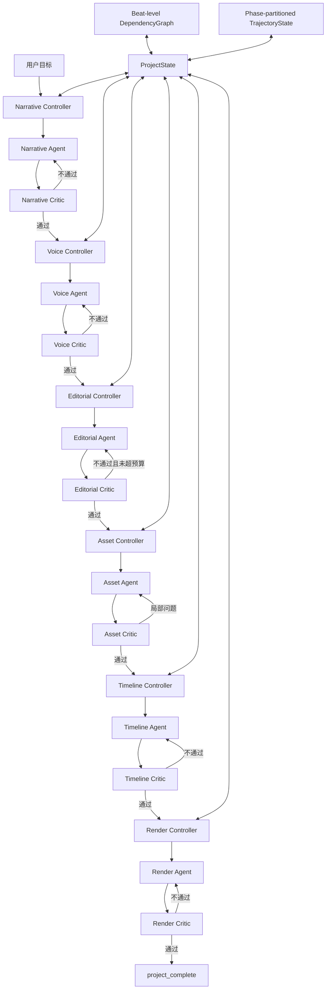
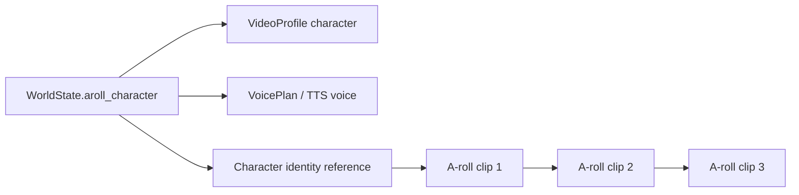

# UGC Video Generation Harness 设计文档

> 文档状态：当前实现（2026-08-03）  
> 适用项目：`ugc-video-harness 0.8.1`

## 1. 设计目标

本项目已经从固定 Stage Pipeline 改造为以状态、任务和审查结果驱动的 Harness。

系统的核心问题不再是“下一个 Stage 是什么”，而是：

- 当前项目状态是什么；
- 当前 Agent 的输入是否仍然有效；
- 本次任务只允许修改哪些对象；
- 最终产物是否通过独立 Critic；
- 某个 Beat 修改后，哪些下游节点需要失效；
- 能否只修复局部对象并复用其余产物；
- 达到重试预算后如何停止或采用最佳候选。

当前核心公式为：

```text
ProjectState
+ TaskEnvelope
+ Domain Agent
+ Tool Registry
+ Independent Critic
+ DependencyGraph
+ TrajectoryState
+ Controller Commit
= UGC Video Harness
```

旧的 `stage_one` 至 `stage_seven` 已删除，不再作为运行架构或兼容层保留。

## 2. 总体架构



状态转换遵循统一规则：前一个 Agent 的最终产物只有在独立 Critic 审核通过后，Controller 才提交状态并开放下一个 Agent。

## 3. 代码结构

```text
src/ugc_harness/
├── agents/
│   ├── base.py
│   ├── narrative_agent/
│   ├── voice_agent/
│   ├── editorial_agent/
│   ├── asset_agent/
│   ├── timeline_agent/
│   └── render_agent/
├── evaluators/
│   ├── narrative_critic.py
│   ├── voice_critic.py
│   ├── editorial_critic.py
│   ├── asset_critic.py
│   ├── timeline_critic.py
│   └── render_critic.py
├── harness/
│   ├── models.py
│   ├── controller.py
│   ├── voice_controller.py
│   ├── editorial_controller.py
│   ├── asset_controller.py
│   ├── timeline_controller.py
│   ├── render_controller.py
│   ├── dependencies.py
│   ├── dependency_builders.py
│   ├── repair.py
│   ├── trajectory.py
│   └── transitions.py
├── profiles/
├── tools/
│   └── registry.py
└── shared/
```

确定性能力继续由普通函数或受控工具执行，例如 TTS 请求、音频拼接、字级时间戳、图片裁切、末帧提取、Remotion 渲染和 FFprobe 检测。Agent 负责决策，工具负责执行，Controller 负责治理。

当前使用进程内 `ToolRegistry` 提供白名单工具。未来可以增加 MCP 适配层，但 MCP 不是 Harness 状态治理的替代品。

## 4. ProjectState

`ProjectState` 是所有 Controller 的共享事实源，由四部分组成。

### 4.1 RuntimeContext

保存当前运行环境中可使用的模型、工具和约束。旧文档把这部分称为 World State；现在改名为 `RuntimeContext`，避免与视频自身的世界状态混淆。

```json
{
  "available_models": {
    "llm": ["google/gemini-2.5-flash"],
    "image": ["google/gemini-3.1-flash-lite-image"],
    "video": ["google/veo-3.1-lite"],
    "tts": ["volcengine"]
  },
  "available_tools": [
    "editorial.create_plan",
    "asset.acquire_requirement",
    "asset.prepare_image",
    "timeline.compose",
    "render.execute"
  ],
  "constraints": {
    "aspect_ratio": "9:16",
    "language": "zh-CN"
  }
}
```

### 4.2 VideoWorldState

`VideoWorldState` 描述“这条视频所讲述的世界”，由 Narrative Agent 在规划阶段产生，而不是运行机器当前有哪些工具。

它包括：

- `topic_frame`：视频采用的主题框架；
- `entities`：人物、地点、事件和概念；
- `claims`：需要在后续阶段验证或表达的主张；
- `timeline_context`：内容中的时间背景；
- `location_context`：内容中的空间背景；
- `aroll_character`：A-roll/AB-roll 固定人物设定。

人物设定示例：

```json
{
  "character_id": "host_main",
  "visual_description": "20-30岁、亲切有活力的年轻女性文化创作者",
  "voice_profile": {
    "gender": "female",
    "age_style": "young",
    "tone": "warm and energetic",
    "pace": "natural"
  }
}
```

约束：

- `a_roll` 和 `ab_roll` 必须定义 `aroll_character`；
- `VideoProfile.character_id`、人物描述与 WorldState 必须一致；
- `b_roll` 不允许定义 A-roll 人物；
- Voice Agent 和 Asset Agent 都从同一个人物节点读取身份信息。

### 4.3 VideoState

`VideoState` 保存项目版本与各 Agent 状态：

```json
{
  "project_id": "ugc_topic_a9aee945",
  "state_version": 11,
  "narrative_status": "passed",
  "voice_status": "passed",
  "editorial_status": "passed",
  "asset_status": "passed",
  "timeline_status": "passed",
  "render_status": "passed",
  "current_agent": "project_complete"
}
```

常用状态包括：`pending`、`ready`、`passed`、`needs_revision`、`stale` 和 `blocked`。

### 4.4 TrajectoryState

Trajectory 按阶段划分，每个阶段保存所有生成任务、审核失败任务、revision Task 和 repair Task。

```text
trajectory.phases
├── narrative.tasks[]
├── voice.tasks[]
├── editorial.tasks[]
├── asset.tasks[]
├── timeline.tasks[]
└── render.tasks[]
```

每条任务记录包括：

- TaskEnvelope；
- AgentResult 与所有工具 Action；
- EvaluationResult；
- TransitionRecord；
- GraphUpdateRecord；
- 输入状态版本与提交版本；
- 任务类型：generation、revision 或 repair。

Trajectory 用于恢复、审计、定位失败、限制重试和解释自动决策。

## 5. Agent 执行契约

### 5.1 TaskEnvelope

Controller 必须通过结构化任务约束 Agent：

```json
{
  "task_id": "task_asset_revision_project_v6",
  "agent": "asset_agent",
  "goal": "只重新生成审核失败的视觉需求",
  "scope": {
    "project_id": "project",
    "beat_ids": ["b04"],
    "visual_request_ids": ["vr04"]
  },
  "based_on_state_version": 6,
  "allowed_tools": ["asset.acquire_requirement"],
  "forbidden_actions": [
    "modify_narrative",
    "modify_voice",
    "modify_editorial_plan"
  ],
  "budget": {
    "max_steps": 4,
    "max_retries": 0,
    "fallback_policy": "fail"
  },
  "input_hash": "...",
  "dependency_snapshot": []
}
```

### 5.2 AgentResult

Agent 不能直接决定项目状态，只能返回候选产物、工具轨迹和受限 `StatePatch`。Controller 会检查：

- task_id 和 input_hash 是否匹配；
- `state_version_used` 是否仍是最新版本；
- 是否修改了禁止字段；
- 依赖快照是否仍然有效；
- Critic 是否批准最终 Artifact。

旧状态结果会以 `STALE_RESULT` 拒绝，不允许覆盖新版本。

### 5.3 CriticIssue

Critic 输出可执行问题，而不是只有布尔值：

```json
{
  "critic_id": "asset_critic",
  "scope": "asset",
  "target_ref": "asset:asset_vr04",
  "severity": "error",
  "code": "BLOCKING_OVERLAY",
  "diagnosis": "登录弹窗遮挡主体",
  "repair_options": ["retry_next_direction"]
}
```

Critic 只读，不直接改 Artifact。修复由 Controller 创建新任务并交回对应 Agent。

## 6. DependencyGraph

DependencyGraph 精确到 Beat 粒度，每个节点同时保存：

- `depends_on`：当前节点依赖谁；
- `dependents`：谁依赖当前节点；
- `semantic_hash`：内容语义哈希；
- `version`：节点版本；
- `status`：current、stale 等；
- `produced_by` 与 `last_task_id`；
- `locked`：是否禁止自动覆盖。

每次任务完成后，Controller 都会提交或拒绝一次图更新，并把记录写入 Trajectory。

典型 Beat 依赖：

```mermaid
flowchart LR
    PB["planned_beat:pb04"] --> SS["script_segment:ss04"]
    SS --> VS["voice_segment:vs04"]
    VS --> RB["realized_beat:b04"]
    RB --> VR["visual_requirement:vr04"]
    VR --> AS["asset:asset_vr04"]
    AS --> IN["asset_inspection:asset_vr04"]
    IN --> PI["prepared_image:asset_vr04"]
    PI --> CL["clip:clip_b04"]
    CL --> TL["artifact:timeline"]
    TL --> RE["render:final"]
```



对于 A-roll，依赖图还包含：

```text
world:video
└── character_reference:host_main
    ├── asset:asset_vr01
    ├── asset:asset_vr02 -> depends_on asset:asset_vr01
    └── asset:asset_vr03 -> depends_on asset:asset_vr02
```

只有相邻的同人物 A-roll 才依赖上一段人物视频。被 B-roll 隔开的下一段 A-roll 仍依赖同一人物参考，但不依赖上一动作片段。

## 7. 失效与局部 Repair

输入节点变化时，只使其真正的下游失效。

修改单个 Script Beat：

```text
script_segment:ss04
→ voice_segment:vs04
→ alignment / realized_beat:b04
→ visual_requirement:vr04
→ asset / caption / clip
→ timeline
→ render:final
```

其他 Beat 的剧本、音频和素材保持 current。

下游失效后不能继续消费旧产物。`RepairScheduler` 会从 stale 子图的可执行前沿创建局部 Task；修复并通过 Critic 后，节点重新变为 current，下游再按依赖顺序重建。

Asset Controller 还支持两类局部修复：

1. revision：仅重新搜索或生成不可修复的失败 VisualRequirement；
2. image repair：对低分辨率、主体过小、文字不可读或缺少竖屏成品的图片执行 `asset.prepare_image`。

登录/认证遮挡不允许通过裁切掩盖，必须重新获取素材。

当一次审核同时出现“重新获取素材”和“图片处理”两类问题时，Controller 先局部 revision，再自动执行 image repair，不会重生成已通过的 A-roll 视频或其他 Beat 素材。

## 8. Agent 核心流程

### 8.1 Narrative Agent

```text
CreativeBrief
→ VideoProfile
→ VideoWorldState
→ SectionPlan
→ PlannedBeat
→ ScriptSegment
→ Narrative Critic
```

Narrative Agent 负责视频的内容世界、叙事结构和脚本。A-roll 人物必须在此阶段进入 WorldState，后续 Agent 不得各自创造一套人物定义。

### 8.2 Voice Agent

```text
Approved Narrative
→ 读取 WorldState.aroll_character.voice_profile
→ 选择 voice_id / tone / speed / pause
→ TTS
→ WordAlignment
→ RealizedBeat
→ Voice Critic
```

A-roll/AB-roll 下，Voice Critic 检查 `character_id`、gender 和 age_style 与 WorldState 一致。B-roll 没有固定人物，可使用默认旁白声线。

### 8.3 Editorial Agent

```text
Narrative + RealizedBeat
→ ClaimMap
→ A-roll/B-roll 判断
→ VisualRequirement per Beat
→ Editorial Critic
```

每个 Beat 只能有一个最终 VisualRequirement，但可以带多个按优先级排列的探索方向。

人物占比按真实 Beat 时长计算，不按 Beat 数量计算。Critic 不通过时：

1. 记录本次失败 Task；
2. Controller 创建 revision Task；
3. Prompt 带上实际比例、目标范围、Critic 诊断和上一版计划；
4. Agent 修改后重新审核；
5. 最多生成 3 个候选；
6. 第三次仍不满足时，记录警告并采用第三版 `use_best_available`。

### 8.4 Asset Agent

```text
VisualRequirement
→ 按顺序尝试 Direction
→ Web Search / Page Capture / Image Generation / Video Generation
→ first-success
→ Asset Critic
→ revision 或 image repair
```

Asset Critic 已吸收旧图片处理阶段的职责，检查：

- 登录或认证遮挡；
- 主体/重点区域是否足够大；
- 文字是否可读；
- 分辨率与 9:16 适配；
- 来源和生成披露；
- A-roll 是否为动态视频；
- 人物身份与动作连续链是否正确。

### 8.5 Timeline Agent

以真实 TTS 音频为唯一主时钟：

```text
TimedAudio + RealizedBeat + Approved Assets
→ Clip
→ CaptionCue
→ Overlay
→ VisualTransform
→ Timeline Critic
```

静态图片可使用轻推、平移和聚焦；已有视频使用裁切或循环适配真实 Beat 时长。

### 8.6 Render Agent

```text
Approved Timeline
→ Remotion 1080x1920 / 30 FPS
→ H.264 + AAC
→ FFprobe
→ Render Critic
→ project_complete
```

Render Agent 不得自行改变内容和时间线，只负责确定性合成、媒体检测和有限故障恢复。

## 9. Video Profile

### 9.1 B-roll

- `speaker_presence_ratio = 0`；
- `world_state.aroll_character = null`；
- 画外音为主；
- 证据类优先 Web Search 和页面捕获；
- 解释、氛围和注意力刷新可使用 AI 图片、AI 视频或动效；
- 不生成 `talking_head`。

### 9.2 A-roll

- 人物口播为主；
- 必须定义固定人物及匹配声线；
- A-roll 必须输出动态 MP4，而不是静态人物图；
- 同一人物始终复用一个 identity reference；
- 相邻人物片段使用上一视频末帧作为下一视频首帧；
- 允许自然眨眼、呼吸、头部和手部动作；
- 当前不要求人物口型与 TTS 精确同步。

### 9.3 AB-roll

- 人物口播为主，证据或说明画面为辅；
- 默认人物出镜目标范围由 VideoProfile 指定，当前常用为 55%–75%；
- 相邻 A-roll 必须动作连续；
- 中间出现 B-roll 后，后续 A-roll 保持人物身份、服装与环境一致，但重新开始自然动作，不继承上一动作组。

```text
A1 → A2 → A3 | B1 → B2 → B3 | A4 → A5
└─ action group 01 ─┘         └ group 02 ┘
└──────────── same character identity ────────────┘
```

## 10. A-roll 人物与语音一致性

人物身份只有一个事实源：`VideoWorldState.aroll_character`。



默认 TTS 映射可通过环境变量覆盖：

- `VOLCENGINE_TTS_MALE_VOICE_ID`；
- `VOLCENGINE_TTS_FEMALE_VOICE_ID`；
- `VOLCENGINE_TTS_NEUTRAL_VOICE_ID`。

Voice CLI 只有在用户显式传入 `--voice-id` 时才覆盖自动人物声线选择。

## 11. 状态转换与重试

统一提交规则：

```text
Agent candidate
→ Controller 校验 Task 和状态版本
→ Independent Critic
→ passed: commit graph + advance next agent
→ failed: reject graph update + record trajectory + create revision/repair
```

关键性质：

- Critic 不通过时不会开放下一个 Agent；
- rejected candidate 不会污染 current DependencyGraph；
- 每次失败和修改都保存在对应阶段 Trajectory；
- 局部任务只能修改 scope 内对象；
- 任务达到预算后按 `fallback_policy` 停止或采用最佳候选；
- Controller 提交成功后 `state_version` 单调递增。

## 12. Artifact 与项目目录

每个项目目录包含领域 Artifact、Harness 记录和媒体文件：

```text
outputs/<project>/
├── narrative_artifact.json
├── voice_artifact.json
├── editorial_artifact.json
├── asset_artifact.json
├── timeline_artifact.json
├── render_artifact.json
├── audio/
├── assets/
│   ├── character_reference/
│   ├── generated_video/
│   └── prepared/
├── video/
│   ├── preview.mp4
│   └── final.mp4
└── harness/
    ├── project_state.json
    ├── *_task.json
    ├── *_agent_result.json
    ├── *_evaluation.json
    └── *_transition.json
```

Artifact 文件是领域产物；`harness/` 文件解释它为何产生、基于哪个版本、是否通过审核以及如何转换状态。

## 13. 当前验收结果

当前自动测试共 49 项，覆盖：

- Narrative、Voice、Editorial、Asset、Timeline、Render Agent；
- Critic 通过与拒绝状态转换；
- Beat 级双向 DependencyGraph；
- 单 Beat 修改后的下游失效；
- 局部 Repair Task；
- 图片登录遮挡与竖屏修复；
- Editorial 三候选 revision 预算；
- WorldState 人物与 TTS 声线一致性；
- 动态 A-roll；
- 相邻 A-roll 动作依赖；
- B-roll 切断动作组但保持人物身份；
- 音频主时钟和最终媒体规格。

端午节主题已完成两种端到端样例：

- `outputs/端午节文化短视频-动态Aroll`：AB-roll，动态固定人物与连续动作；
- `outputs/端午节文化短视频-Broll`：纯 B-roll，无人物口播画面。

## 14. 当前边界与后续方向

当前暂未实现或不作为本轮要求：

- A-roll 口型与 TTS 音频的精确同步；
- 面向所有阶段的单一常驻 Director Agent；
- 跨机器分布式 Scheduler；
- 完整 GUI 与 Schema Studio；
- MCP Server 化的远程工具层；
- 全片语义级 Global Critic 自动回溯所有 Agent。

这些能力可以在现有 TaskEnvelope、DependencyGraph、Trajectory 和 Controller 提交协议上继续扩展，不需要恢复旧 Stage Pipeline。

## 15. 最终结论

项目当前不是“在 Pipeline 外包一层 Agent”，而是由多个受约束领域 Agent、独立 Critic、版本化 ProjectState、Beat 级 DependencyGraph 和阶段化 Trajectory 共同构成的 Harness。

其核心保证是：

1. 只有审核通过的最终产物才能进入下一个 Agent；
2. Agent 不能绕过 Controller 直接修改项目状态；
3. 所有任务都携带 scope、预算、输入哈希和状态版本；
4. 每个 Beat 的依赖和反向依赖都可追踪；
5. 修改后只失效真正受影响的下游；
6. Repair 完成前，任何 Agent 都不能消费 stale 产物；
7. A-roll 人物外观、TTS 声线、身份参考和动作连续性来自同一条状态链；
8. 达到 revision 预算后按照明确 fallback 规则终止，不允许无限循环。
