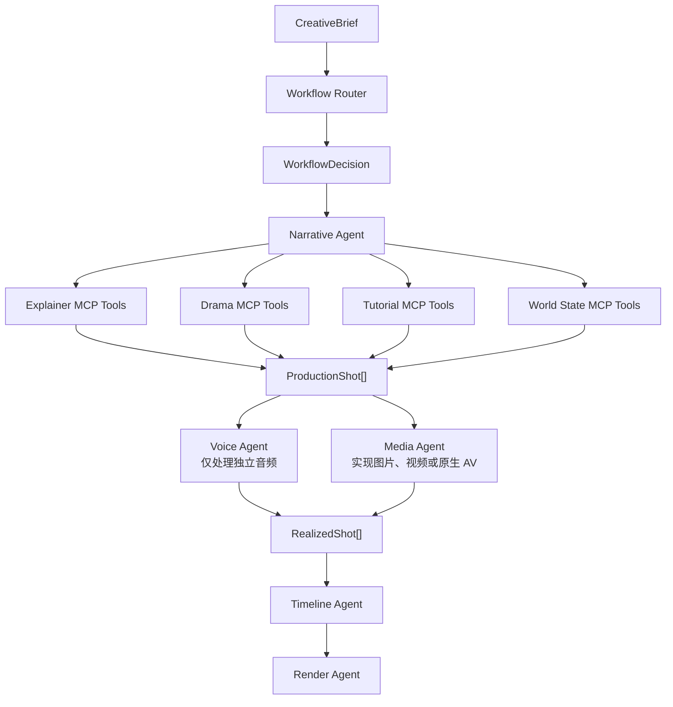
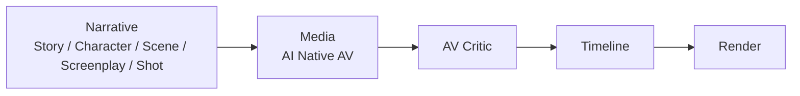
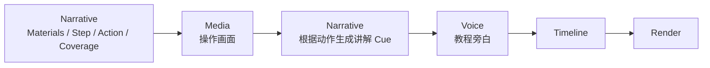

# 多类型视频 Agent 架构方案

## 1. 背景与目标

当前 UGC Video Harness 的核心流程以科普口播为中心：

```text
CreativeBrief
→ Section
→ PlannedBeat
→ ScriptSegment
→ Voice/TTS
→ RealizedBeat
→ VisualRequirement
→ Asset
→ Timeline
→ Render
```

这条流程能够较好地支持科普、知识解释和观点口播，但无法自然覆盖另外两类视频：

- 剧情演绎类：人物、场景、冲突、台词、动作、镜头和视听连续性共同驱动。
- 制作教程类：材料、工具、操作步骤和物体状态变化驱动画面，讲解依附于动作。

本方案的目标不是为每一种视频增加一套孤立 Pipeline，也不是为角色、场景、动作等
能力分别创建 Agent，而是建立：

> 少量稳定领域 Agent + Workflow 控制 + MCP Tool 能力编排 + Shot-first 生产边界。

## 2. 核心设计原则

### 2.1 Agent 是稳定的领域责任边界

Agent 不与每个生成阶段一一对应。同一个 Agent 可以在一个 Workflow 中被多次调度，
完成不同 Task。

建议保留五个领域 Agent：

```text
Narrative Agent
Voice Agent
Media Agent
Timeline Agent
Render Agent
```

Harness Controller 和 Critic 不属于领域 Agent：

- Harness Controller：权限、预算、状态版本、依赖、调度和提交。
- Critic：独立验收候选产物，不参与生成。

### 2.2 Tool 是细粒度能力

角色设计、场景设计、剧情动作、教程步骤和 Shot 编译都是 Narrative Agent 的内部能力，
通过 MCP Tools 暴露，不需要额外创建 Character Agent、Scene Agent 或 Action Agent。

### 2.3 Artifact 是 Agent 和 Tool 之间的稳定协议

Tool 不直接修改 Project State，而是输出候选 Artifact 或 State Patch。Harness 在版本和
Scope 校验、Critic 通过后才提交。

### 2.4 Workflow 决定顺序和工具权限

Workflow 不决定 Agent 身份，而是决定：

- 同一批 Agent 的调用顺序。
- 当前 Task 可见的 MCP Tools。
- 必须生成的中间 Artifact。
- 使用的 Critic。
- 音频、画面和时长驱动策略。

### 2.5 Shot 是公共生产单位，不是所有上游语义单位

科普 Beat、剧情 Scene/Dramatic Beat、教程 Step/Action 具有不同语义，不应强行使用同一
Schema。但三者可以编译为统一的 `ProductionShot[]`，在媒体实现后统一成为
`RealizedShot[]`。

## 3. 总体架构



三类视频可以在上游使用不同的规划工具，但必须在 Timeline 之前收敛到统一的
`RealizedShot` Contract。

## 4. Agent 职责

### 4.1 Narrative Agent

Narrative Agent 是所有创作语义和 World State 的语义 Owner，负责：

- 分析 CreativeBrief。
- 选择或服从指定的 Production Workflow。
- 选择 Workflow 内的具体 Format。
- 维护人物、物品、地点、材料、工具、事实主张和状态变化。
- 科普 Section、Information Beat 和口播脚本。
- 剧情 Story、Character、Scene、Screenplay、Action 和 Shot。
- 教程 Materials、Step、Action、Coverage 和 Narration Cue。
- 将领域规划编译为 `ProductionShot[]`。
- 根据 Critic 或用户反馈进行局部修复。

Narrative Agent 可以在同一个项目中被多次调度，例如：

```text
Task 1：建立 World State 和内容结构
Task 2：生成 Script 或 Screenplay
Task 3：编译 ProductionShot
Task 4：根据真实音频或画面修订 Shot
Task 5：局部修复指定角色、Scene、Step 或 Shot
```

### 4.2 Voice Agent

Voice Agent 只负责独立生成的音频：

- 科普旁白 TTS。
- 教程讲解 TTS。
- 字词对齐、字幕时间戳和音频时长。
- 未来明确允许时的独立角色配音。

剧情演绎类的原生音频不经过 Voice Agent。

### 4.3 Media Agent

Media Agent 负责将 `ProductionShot` 实现为媒体：

- 搜索或获取素材。
- 生成图片和视频。
- 生成剧情类原生音视频片段。
- 处理用户提供的教程操作素材。
- 检查媒体格式、内容和一致性。
- 输出 `RealizedShot`。

当前 Asset Agent 可以逐步演进为 Media Agent。

### 4.4 Timeline Agent

Timeline Agent 只消费已经实现的 Shot：

- Shot 排序和轨道编排。
- 音视频同步。
- 原声、旁白、音乐和环境音混合。
- 字幕、Overlay 和转场。
- 裁剪、延长和最终时长解析。

### 4.5 Render Agent

Render Agent 负责把 Timeline 转换为渲染输入，调用 Remotion/FFmpeg，检查输出媒体并生成
最终成片。

## 5. Workflow 与 Format

### 5.1 Production Mode

CreativeBrief 增加用户可理解的生产类型：

```python
production_mode: Literal[
    "auto",
    "explainer",
    "drama",
    "tutorial",
]
```

### 5.2 WorkflowDecision

Router 只解析一次生产类型，然后锁定 Workflow：

```python
class WorkflowDecision:
    requested: str
    resolved: Literal["explainer", "drama", "tutorial"]
    workflow_id: str
    workflow_version: str
    selection_source: Literal["user", "agent"]
    rationale: str
```

后续 Task 继承 `workflow_id + workflow_version`，不要求模型在每次 Tool Call 中重复填写
视频类型。

### 5.3 Workflow Pack

Workflow Pack 决定生产 DAG、工具命名空间、Artifact 类型和 Critic。例如：

```yaml
id: drama_production
version: 1.0.0

allowed_tool_namespaces:
  - world.*
  - narrative.drama.*
  - media.drama.*

audio_policy:
  source: native_video_audio
  voice_agent_required: false

required_artifacts:
  - StoryBible
  - CharacterBible
  - ScenePlan
  - Screenplay
  - ProductionShotPlan
```

### 5.4 Format Pack

Format Pack 位于 Workflow 内部，只控制同一种生产流程中的具体结构：

```text
explainer_production
├── knowledge_explainer
├── myth_busting
├── listicle
└── comparison

drama_production
├── family_micro_drama
├── comedy_skit
├── suspense_reveal
└── dialogue_scene

tutorial_production
├── food_making
├── handicraft
├── product_assembly
└── software_demo
```

Workflow 决定“怎么生产”，Format 决定“在该生产方式下怎么组织内容”。

## 6. 三类 Workflow

### 6.1 科普类


核心特征：

- Information Beat 是语义主轴。
- 独立旁白是主要音频。
- `duration_driver = narration`。
- 一个 Beat 可以编译为一个或多个 Shot。

### 6.2 剧情演绎类



核心特征：

- 人物、冲突、Scene、台词、动作和镜头共同驱动。
- 所有剧情片段必须由支持原生音频的视频模型生成。
- 视频、台词、口型、动作、环境音是耦合产物。
- `audio_source = native_video_audio`。
- `voice_agent_required = false`。
- 外部 TTS 不得作为失败兜底，失败时重新生成整个 AV Clip。

剧情 Workflow 的 Harness 白名单应禁止：

```text
audio.synthesize_narration
asset.search_stock_video
```

并只允许符合策略的生成能力：

```text
media.drama.generate_av_clip
media.drama.inspect_av_clip
media.drama.regenerate_av_clip
```

### 6.3 制作教程类



核心特征：

- Step、Action 和物体状态变化是语义主轴。
- 每一步必须定义可观察的完成状态。
- 画面通常先于最终讲解确定。
- `duration_driver = visual_action | source_media`。
- 音频可以是独立讲解、原声、原声加讲解或静音。

## 7. Narrative MCP Tool 设计

Narrative Agent 通过官方 MCP SDK 与独立 stdio MCP Server 通信。

### 7.1 公共工具

```text
narrative.configure_task
narrative.inspect_project
narrative.compile_shots
narrative.review_plan
narrative.revise_artifact
narrative.submit_candidate

world.read
world.propose_patch
world.validate
```

### 7.2 科普工具

```text
narrative.explainer.plan_sections
narrative.explainer.expand_beats
narrative.explainer.write_script
narrative.explainer.compile_shots
```

### 7.3 剧情工具

```text
narrative.drama.design_world
narrative.drama.plan_story
narrative.drama.expand_scenes
narrative.drama.compile_shots
```

### 7.4 教程工具

```text
narrative.tutorial.plan_materials
narrative.tutorial.plan_steps
narrative.tutorial.plan_actions
narrative.tutorial.plan_coverage
narrative.tutorial.write_narration_cues
narrative.tutorial.compile_shots
```

Agent 每次只看到当前 Workflow、当前状态和 TaskEnvelope 允许的 Tools。模型决定调用哪个
Tool，Harness 决定该调用是否合法。

## 8. World State

### 8.1 所有权

```text
Narrative Agent：World State 的语义 Owner
Harness Controller：World State 的提交 Owner
其他 Agent：World State 的只读消费者
```

Narrative Agent 只能提交 `WorldStatePatch`，不能直接覆盖 Project State。

### 8.2 实体模型

```python
WorldEntity = (
    CharacterEntity
    | LocationEntity
    | PropEntity
    | MaterialEntity
    | ToolEntity
    | ProductEntity
    | ConceptEntity
    | OrganizationEntity
    | EventEntity
)
```

不同 Workflow 使用同一个 Entity Registry，但关注不同实体：

- 科普：人物、组织、事件、概念、事实主张。
- 剧情：角色、地点、服装、道具、人物关系。
- 教程：材料、工具、半成品、成品和安全要求。

### 8.3 状态转换

World State 不只记录“有什么”，还要记录实体随 Scene、Action 和 Shot 发生的变化：

```python
class WorldStateTransition:
    transition_id: str
    caused_by_ref: str
    entity_id: str
    before: dict[str, object]
    after: dict[str, object]
    reason: str
```

示例：

```text
剧情：手机在桌上 → 人物拿起手机 → 手机位于人物右手
教程：木板未打磨 → 已打磨 → 已钻孔 → 已安装桌腿
```

每个 Shot 可以引用：

```text
world_state_before_ref
world_state_transition_ref
world_state_after_ref
```

Media Agent 发现画面与 World State 不一致时，只能报告
`REALIZED_MEDIA_WORLD_MISMATCH` 并重新生成，不能修改 World State。

## 9. ProductionShot

### 9.1 定义

`ProductionShot` 定义为：

> 一段可以被独立实现并放入时间线的连续视听单元，具有一个主要视觉来源和一个主要时长驱动因素。

一个上游语义单位可以对应多个 Shot：

- 一个科普 Beat：人物口播 Shot + 证据截图 Shot + 回到人物 Shot。
- 一个教程 Step：全景 Shot + 手部特写 Shot + 完成状态 Shot。
- 一个剧情 Dramatic Beat：正打 Shot + 反打 Shot + 反应 Shot。

### 9.2 公共外壳

```python
class ProductionShot:
    shot_id: str
    order: int
    shot_kind: Literal["explainer", "drama", "tutorial"]
    purpose: str
    source_refs: list[str]
    world_state_before_ref: str | None
    realization: ShotRealizationSpec
    payload: ShotPayload
```

### 9.3 类型化 Payload

```python
ShotPayload = (
    ExplainerShotPayload
    | DramaShotPayload
    | TutorialShotPayload
)
```

不能使用无约束 `dict` 承载所有差异，否则下游会充满脆弱的 `if shot.type` 分支。

## 10. ShotRealizationSpec

三类 Shot 的生成策略不同，因此不应强行拆成完全独立的 `VisualSpec + AudioSpec`。

```python
ShotRealizationSpec = (
    ExplainerRealizationSpec
    | DramaRealizationSpec
    | TutorialRealizationSpec
)
```

### 10.1 科普

```python
class ExplainerRealizationSpec:
    realization_type: Literal["explainer"]
    visual_source: str
    audio_source: Literal["external_narration"]
    duration_driver: Literal["narration"]
```

### 10.2 剧情

```python
class DramaRealizationSpec:
    realization_type: Literal["drama"]
    media_source: Literal["ai_generated_av_clip"]
    audio_source: Literal["native_video_audio"]
    require_audio_track: bool = True
    require_dialogue_audio: bool = True
    require_lip_sync: bool = True
    allow_external_dubbing: bool = False
    duration_driver: Literal["generated_av_clip"]
```

### 10.3 教程

```python
class TutorialRealizationSpec:
    realization_type: Literal["tutorial"]
    visual_source: Literal["user_footage", "ai_generated_action_video"]
    audio_source: Literal[
        "native_video_audio",
        "external_narration",
        "native_plus_narration",
        "silent",
    ]
    duration_driver: Literal["visual_action", "source_media"]
```

## 11. RealizedShot

规划阶段的 Shot 表达“需要什么”，媒体阶段的 RealizedShot 表达“实际得到了什么”：

```python
class RealizedShot:
    shot_id: str
    production_shot_ref: str
    media_ref: str
    duration_ms: int
    video_track: VideoTrack
    audio_tracks: list[AudioTrack]
    transcript: str | None
    alignment_ref: str | None
    quality_status: Literal["pending", "passed", "needs_revision"]
```

Timeline Agent 只依赖 `RealizedShot`，不关心音频来自：

- 外部 TTS。
- 视频模型原生音轨。
- 用户素材原声。
- 原声与旁白的组合。

## 12. Shot 与生成单位

Shot 是 Timeline 最小单位，但不一定是视频模型调用的最小单位。剧情连续性可能要求把同一
Scene 的多个 Shot 放入一个 `AVGenerationGroup`：

```python
class AVGenerationGroup:
    generation_group_id: str
    scene_id: str
    shot_ids: list[str]
    character_refs: list[str]
    scene_ref: str
    voice_continuity_required: bool
    acoustic_continuity_required: bool
```

允许两种实现：

```text
一个 Shot → 一个 AI AV Clip

多个连续 Shot → 一个较长 AI AV Clip
               → 后续切分为多个 RealizedShot
```

## 13. Critic 设计

### 13.1 科普

- 主张与证据需求。
- Beat 覆盖。
- 信息推进和 Hook 回扣。
- 口播可读性。

### 13.2 剧情

- 故事冲突和 Scene 功能。
- 角色外观、服装、声音和关系一致性。
- 台词、口型、动作和情绪匹配。
- 跨 Shot 空间、道具和环境音连续性。
- 视频是否包含有效原生音轨。

剧情片段的画面、台词或音频失败时，修复单位是整个 AV Clip，而不是单独补 TTS。

### 13.3 教程

- 步骤完整性和依赖顺序。
- 材料与工具前置条件。
- 操作是否可观察、可复现。
- 每一步是否具有明确完成状态。
- 安全要求。
- 讲解是否与实际动作同步。

## 14. Harness 安全边界

即使 Agent 自主调用 MCP Tools，Harness 仍负责：

- `TaskEnvelope.allowed_tools` 白名单。
- Workflow 和 Format 锁定。
- 最大步骤数、重试次数、成本和 Deadline。
- State Version 和 Input Hash。
- Artifact Scope。
- Dependency Snapshot。
- Critic 验收。
- World State Patch 和 Project State commit。

控制关系是：

> Agent 决定下一步调用什么，Harness 决定哪些下一步是合法的。

## 15. 当前实现状态

当前已完成：

- Narrative Agent 使用官方 MCP Python SDK v2。
- 使用独立 stdio MCP Server。
- 通过 MCP `initialize`、`tools/list` 和 `tools/call` 工作。
- 模型通过原生 tool calling 选择 Narrative Tool。
- Harness 保留工具白名单、预算、ActionRecord、Critic 和 commit。
- CLI、应用创建项目和 Narrative 局部修复默认使用 MCP 路径。

当前 MCP Server 已按 §7.2 拆分为科普 Workflow 的细粒度工具：

```text
narrative.configure_task
narrative.explainer.plan_sections
narrative.explainer.expand_beats
narrative.explainer.write_script
narrative.explainer.compile_shots
```

对应的中间 Artifact 为 `SectionPlanArtifact`（world_state + video_profile +
Section 骨架）、`BeatPlanArtifact`（Planned Beats）与 `ShotPlanArtifact`。
`ProductionShot` 已拆分为 `visual`、`audio`、`timing` 和 Format 专属 `payload`；
Planning、Visual、Audio、Payload 均使用判别联合。`PlanningArtifact` 保留为当前
Explainer Pack 组装后的验收产物；`compile_shots` 是确定性编译，不发起模型调用。

第一阶段已加入 `production_mode`、Harness-owned `NarrativeFormatRegistry` 和
`narrative.v3` 公共 Shot 协议。Format Pack 只负责在 Harness 中生成完整
`TaskEnvelope`；Agent 不加载 Pack，也不保存独立的业务 Runtime。MCP Server task session
只保存工具草稿，不提供 Snapshot、固定阶段、revision 或级联失效机制。Agent 根据消息历史
与 ActionRecord 自主选择工具，并主动调用 `submit_candidate` 提交最终候选产物。
三种 Pack 的 TaskEnvelope 合同已经定义，默认 Registry 已安装 Explainer、Drama 与
Tutorial。Drama 已提供 `design_world / plan_story / expand_scenes / compile_shots`
stdio MCP 工具，由 Agent 自主决定调用和修订顺序，并接入 Drama Critic；科普与剧情都只向
Harness 提交聚合的 `artifact:narrative`，不提交格式内部依赖图。Drama Shot 使用视频模型原生音轨并跳过
Voice Agent。MCP Session 已拆成公共产物状态与 `ExplainerFormatState | DramaFormatState |
TutorialFormatState` 作为轻量草稿容器，不承担内部工作流编排。
Tutorial 已提供 `define_result / plan_steps / plan_explanations / compile_shots`，并接入
Tutorial Critic；其 Shot 使用制作动作驱动的混合音频。World State 公共工具（world.*）、
Entity Union 和 RealizedShot 仍属于下一阶段工作。

用于讨论目标结构的端午节 prototype 产物位于：

```text
outputs/端午节三类型narrative/
```

这些文件不是当前 `narrative.v3` 的正式可执行产物。

通过当前 Narrative Agent、stdio MCP、Critic 与 Harness commit 生成的三类 v3 产物位于：

```text
outputs/端午节三类型narrative_agent/
```

## 16. 推荐迁移顺序

### 阶段一：公共 Schema

- 增加 `production_mode` 和 `WorkflowDecision`。
- 定义 World Entity Union 和 State Transition。
- 定义 `ProductionShot`、三类 Payload 和三类 RealizationSpec。
- 定义 `RealizedShot`。

### 阶段二：Narrative MCP Tools

- 将科普现有 Plan/Script Tool 拆成 Section、Beat、Script 和 Shot 编译能力。
- 增加 Drama Story/Character/Scene/Screenplay/Action Tools。
- 增加 Tutorial Materials/Step/Action/Coverage Tools。
- 增加按需读写与校验 World State 的 Tools，不引入额外状态快照协议。

### 阶段三：Workflow 调度

- 实现 Workflow Router。
- 根据 Workflow 动态裁剪 Narrative Tools。
- 由同一个 Narrative Agent 自主调用三类格式工具，Harness 只控制 Agent 流转。
- Workflow 变更时只在 Agent 产物边界执行依赖失效和迁移。

### 阶段四：Media 与 Timeline 收敛

- Asset Agent 演进为 Media Agent。
- 支持剧情原生 AV 生成和联合验收。
- 支持教程操作画面与后置旁白。
- Timeline 改为统一消费 `RealizedShot[]`。

## 17. 最终结论

目标架构不是按视频类型复制三套系统，也不是为每个中间能力创建一个 Agent，而是：

```text
少量稳定领域 Agent
+ Workflow 决定执行顺序和工具权限
+ Narrative Agent 内部调用不同 MCP Tools
+ World State 维护跨 Shot 的人物、物品和状态一致性
+ 不同领域规划统一编译为 ProductionShot
+ 不同媒体实现统一收敛为 RealizedShot
+ Timeline 和 Render 复用
```

这样既能保留当前科普流程已经形成的 Harness、Dependency Graph、Critic 和 Artifact
治理能力，也能为剧情演绎和制作教程提供真正不同的规划与音视频生产路径。
